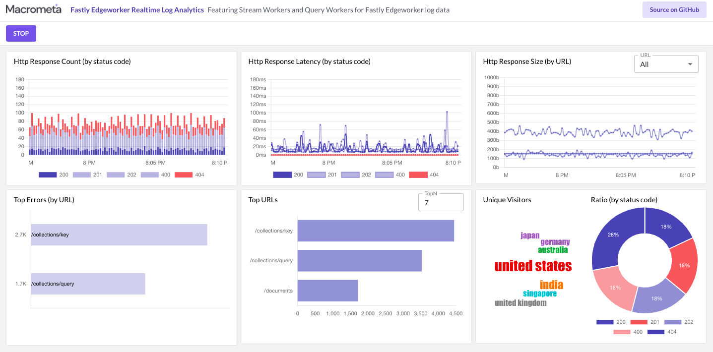

# Fastly JSC8 Realtime Log Analytics using GDN

### Live Demo: https://macrometacorp.github.io/demo-fastly-jsc8-realtime-logs

This tutorial shows you how to integrate Fastly real-time log analytics with Macrometa GDN to monitor the status and activity of Stream workers and Query workers. Fastly provides data about HTTP latency, response count, response size, and unique visitor traffic.

## Setup

| **Federation**                                        | **Email**                              | **Passsword** |
| ----------------------------------------------------- | -------------------------------------- | ------------- |
| [Global Data Network](https://gdn.paas.macrometa.io/) | demo-fastly-realtime-logs@macrometa.io | `xxxxxxxx`    |
| [Fastly Account](https://manage.fastly.com)           | demo@macrometa.com                     | --            |

## Overview

**Dashboard:**



### Macrometa GDN setup

1. Create and publish the following Stream Workers in your federation:

```
fastly-log-generator
fastly-http-request-worker
fastly-http-request-stats-1m-worker
```

Refer to the following links to add content for each Stream worker:

-   **[Request Worker](stream-apps/http-request-worker.md)**

-   **[Request Stats 1 Minute](stream-apps/http-request-stats-1m-worker.md)**

-   **[Logs Generator](stream-apps/log-generator.md)**

2. Create the following Query workers in your federation:

```
fastlyGetTopUrl
fastlyGetStatusCodeRatio
fastlyGetStatsByCollection
fastlyGetTopErrorByUrlPath
fastlyGetUniqueVisitorsByCountry
```

Refer to this link to add content for each Query worker:

**[Query Workers](stream-apps/query-worker.md)**

3. Create the following collections in your federation:

```
fastly_users (global)
fastly_logs (global)
fastly_http_url_stats_1m (global)
fastly_http_response_code_stats_1m (global)
fastly_http_response_latency_stats_1m (global)
fastly_http_error_response_code_stats_1m (global)
fasty_unique_visitor_by_country_stats_1m (global)
```

Note: If you have run this tutorial before, you might want to truncate the collections.

4. On the development machine, run the following commands in a console:

```bash
1. git clone git@github.com:Macrometacorp/demo-fastly-jsc8-realtime-logs.git
2. cd demo-fastly-jsc8-realtime-logs/react-app
3. npm install
4. npm run start
```

## Fastly Compute@Edge setup

### Prerequisite

1. Create API token by following [Fastly API Token doc](https://docs.fastly.com/en/guides/using-api-tokens#creating-api-tokens). The generated token will be used to configure Fastly CLI. **Create Token with `Global API access` Scope**
2. To install and configure Fastly CLI follow [Fastly CLI Doc](https://developer.fastly.com/reference/cli/)
3. Create Fastly Compute@Edge service

    ```bash
    $ fastly service create --name="Fastly Logs Analytics" --type=wasm
    SUCCESS: Created service AAAAAAAAAAA
    ```

4. Update `fastly.toml` file with service ID generated by the above command
5. Create Fastly Compute@Edge backend to connect to GDN
    ```bash
    $ fastly backend create --version=latest --name="gdn_url" --address="api-gdn.paas.macrometa.io" --port=443
    SUCCESS: Created backend gdn_url (service AAAAAAAAAAA version 1)
    ```
6. Setup Fastly Logging with HTTP for the newly created service. In below command, replace `HTTPS_URL` with url which hosts `fastly-logs-capture-service`

    ```bash
    $ fastly logging https create --name="gdn_logging" \
      --version="latest" \
      --url="HTTPS_URL" \
      --method="POST" \
      --json-format=1 \
      --request-max-entries=100 \
      --request-max-bytes=1000000 \
      --content-type="application/json" \
      --placement=none
    ```

7. Create Fastly Dictionary and Dictionary items to store environment variables

    ```bash
    $ fastly dictionary create --version=latest --name="env"
    $ fastly dictionary list --version=latest

    # Replace `DICTIONARY_ID` with dictionary id from above command.
    $ fastly dictionary-item create --dictionary-id="DICTIONARY_ID" --key="backend_name" --value="gdn_url"
    $ fastly dictionary-item create --dictionary-id="DICTIONARY_ID" --key="logging_endpoint_name" --value="gdn_logging"
    $ fastly dictionary-item create --dictionary-id="DICTIONARY_ID" --key="gdn_api_key" --value="GDN_API_KEY"
    $ fastly dictionary-item create --dictionary-id="DICTIONARY_ID" \
      --key="gdn_api_url" \
      --value="https://api-gdn.paas.macrometa.io/_fabric/_system/_api"
    ```

## How to Run and Publish on Fastly Compute@Edge

```bash
git clone git@github.com:Macrometacorp/demo-fastly-jsc8-realtime-logs.git
cd demo-fastly-jsc8-realtime-logs/fastly-compute-service
npm install
npm run dev
npm run deploy
```

In the above deployment command, it will prompt you for a domain, you can either select Fastly generated domain or type your own. Once deployment is complete you will use that domain to access the service

## How to Run in local

```bash
git clone git@github.com:Macrometacorp/demo-fastly-jsc8-realtime-logs.git
cd demo-fastly-jsc8-realtime-logs/fastly-compute-service
npm install
# Remove bin folder
fastly compute serve
```

For more information, refer to [Fastly HTTP Logging Guide](https://docs.fastly.com/en/guides/log-streaming-https).

**Sample Log Format:**

```
{
  "timestamp": "2021-09-02T14:44:31+0000",
  "request_method": "POST",
  "response_status": 400,
  "url": "/collections/query",
  "response_body_size": 134,
  "time_elapsed": 16,
  "geo_country": "india",
  "client_ip": "172.105.56.148"
}
```
