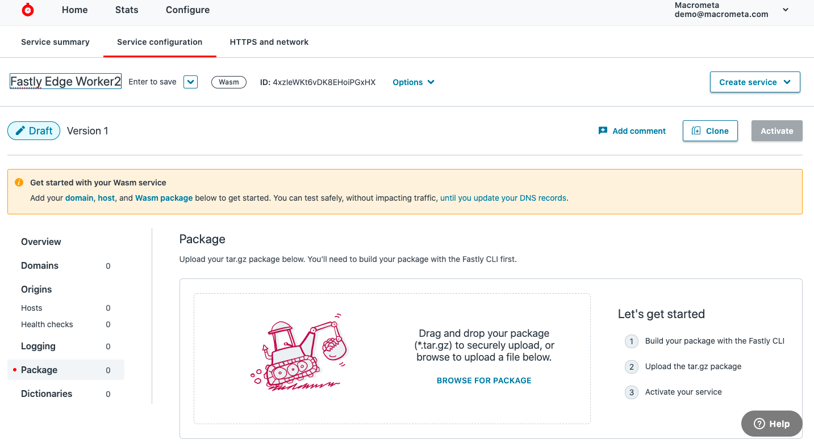
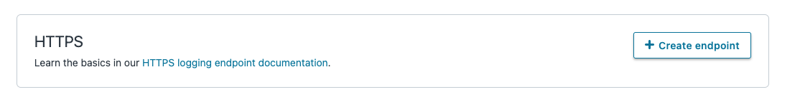
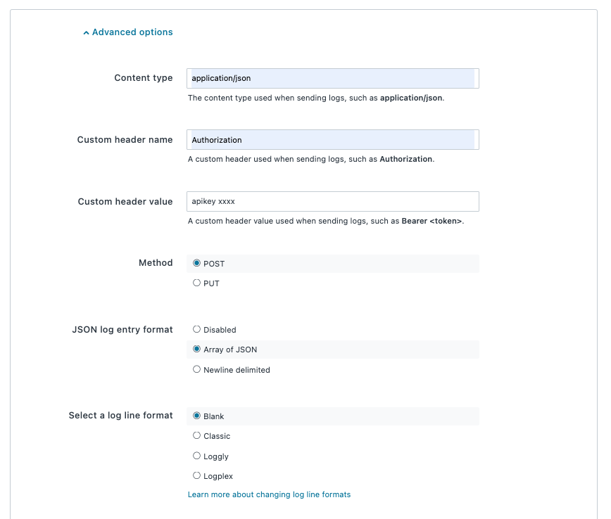

# Fastly JSC8 Realtime Log Analytics using GDN

### Live Demo: https://macrometacorp.github.io/demo-fastly-jsc8-realtime-logs

This tutorial shows you how to integrate Fastly real-time log analytics with Macrometa GDN to monitor the status and activity of Stream workers and Query workers. Fastly provides data about HTTP latency, response count, response size, and unique visitor traffic.

## Setup

| **Federation**                                        | **Email**                              | **Passsword** |
| ----------------------------------------------------- | -------------------------------------- | ------------- |
| [Global Data Network](https://gdn.paas.macrometa.io/) | demo-fastly-realtime-logs@macrometa.io | `xxxxxxxx`    |
| [Fastly Account](https://manage.fastly.com)           | demo@macrometa.com                     | --            |

## Overview

**Dashboard:**


### Macrometa GDN setup

1. Create and publish the following Stream Workers in your federation:

```
fastly-log-generator
fastly-http-request-worker
fastly-http-request-stats-1m-worker
```

Refer to the following links to add content for each Stream worker:

-   **[Request Worker](stream-apps/http-request-worker.md)**

-   **[Request Stats 1 Minute](stream-apps/http-request-stats-1m-worker.md)**

-   **[Logs Generator](stream-apps/log-generator.md)**

-   **[Relay Logs to GDN](stream-apps/forward-logs-to-gdn.md)**

2. Create the following Query workers in your federation:

```
fastlyGetTopUrl
fastlyGetStatusCodeRatio
fastlyGetStatsByCollection
fastlyGetTopErrorByUrlPath
fastlyGetUniqueVisitorsByCountry
```

Refer to this link to add content for each Query worker:

**[Query Workers](stream-apps/query-worker.md)**

3. Create the following collections in your federation:

```
fastly_users (global)
fastly_logs (global)
fastly_http_url_stats_1m (global)
fastly_http_response_code_stats_1m (global)
fastly_http_response_latency_stats_1m (global)
fastly_http_error_response_code_stats_1m (global)
fasty_unique_visitor_by_country_stats_1m (global)
```

Note: If you have run this tutorial before, you might want to truncate the collections.

4. On the development machine, run the following commands in a console:

```
1. git clone git@github.com:Macrometacorp/demo-fastly-jsc8-realtime-logs.git
2. cd fastly-edgeworker-log-analytics
3. git fetch
4. npm install
5. npm run start
```

fastly edge worker deployment steps as follows

On the development machine, run the following commands in a console:

```
1. cd fastly-server
2. fastly compute serve
```

-   build package will be generated on the `/fastly-server/pkg` directory

-   upload build package to fastly service packages and activate it.



### Fastly Logging Setup

1. In the Fastly service, under Logging set `Choose your logging endpoint` to `HTTP` and click `Create endpoint`.



2. Enter the HTTP endpoint information.

`Sample url: https://api-gdn.eng.macrometa.io/_fabric/_system/_api/document/logs?returnNew=false&returnOld=false&silent=true&overwrite=false`


3. In Advanced options for the HTTP endpoint, add `Authorization` header with header value `apiKey xxxx` and click `Create` button.



4. Verify that Fastly logs are successfully delivering to your GDN logs collection.

For more information, refer to [Fastly HTTP Logging Guide](https://docs.fastly.com/en/guides/log-streaming-https).

**Sample Log Format:**

```
{
  "timestamp": "2021-09-02T14:44:31+0000",
  "request_method": "POST",
  "response_status": 400,
  "url": "/collections/query",
  "response_body_size": 134,
  "time_elapsed": 16,
  "geo_country": "india",
  "client_ip": "172.105.56.148"
}
```
